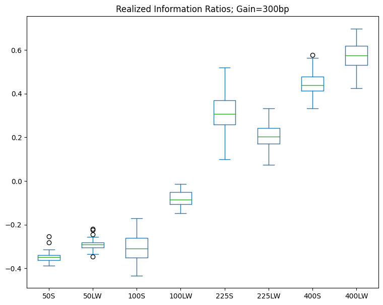
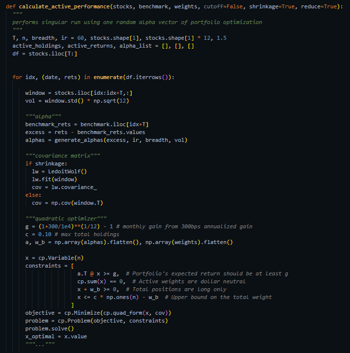
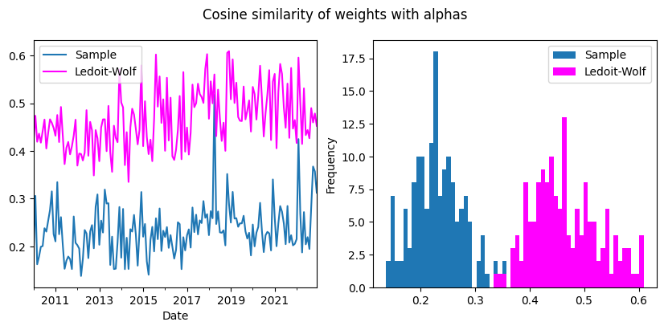

# Honey I Shrunk the Covariance Matrix

I replicate Wolf & Ledoit's -  _Honey: I Shrunk the Covariance Matrix (2003)_ paper, which showed how shrinking covariance matrices increases realized information ratios & decreases tracking error in active portfolio management/portfolio optimization. I replicate the results on modern data: US stock returns from 2005-2022.

I then empirically confirm that active weights generated feeding the Ledoit-Wolf shrunk covariance matrix into the optimizer $\textbf{x}$ have higher similarity to the alpha (excess expected return forecast) $\alpha$ vector and lower turnover, as compared to the SCM.

 
 

Ex-post information ratios for Ledoit-Wolf & sample covariance matrices, N=50, 100, 225, 400 stocks

 

Code of one run of optimization with random excess return forecast

 

Cosine similarity of active weights with alphas over time

